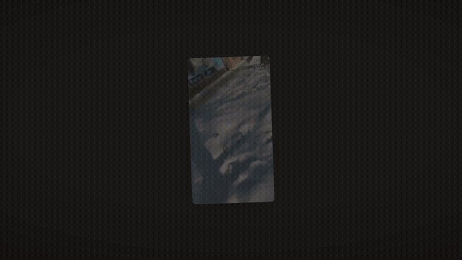

# OpenEyes

<p align="center">
  <a href="media/openeyes-demo.mp4">
    
  </a>
  <br />
  <em>▶ <a href="media/openeyes-demo.mp4">Watch in full quality (MP4)</a> · silent · built with <a href="video/">Remotion</a></em>
</p>

**One witness can lie. Five cannot.**

OpenEyes verifies whether real-world events actually happened, by corroboration instead of single-source detection. Instead of asking one video *"are you real?"*, we ask *"did anyone else see it too?"* — and turn scattered, independent recordings into one verifiable event.

Built for the Open Innovation track, aligned with **UN SDG 16 — Peace, Justice and Strong Institutions**.

---

## The problem

A single video can be faked, and increasingly nobody can tell. That breaks trust in two directions:

- **The lie wins** — a fake spreads faster than it can be debunked.
- **The truth loses** — a real video gets dismissed as a "deepfake," and nobody can prove otherwise (the *liar's dividend*).

A society only holds together while it trusts a shared reality. OpenEyes rebuilds that shared reality from the bottom up.

---

## How it works

The core idea is **corroboration**. One angle is a claim. Many independent angles that line up are proof. You can fake one clip; you cannot easily fake five devices recording the same second, in the same place, from different angles.

```
Capture  ──▶  Match  ──▶  Score  ──▶  Show
 signed       audio       trust       public event
 metadata     sync        score       + every angle
```

---

## Features

### 1. AI verification — is it real or AI?
Every uploaded clip is checked on its own before anything else:
- Deepfake / manipulation detection on frames and audio
- Capture provenance & integrity check (see below)
- Produces a per-clip signal that feeds the overall trust score

> This is the first line of defense, but a single clip is still only a *claim*. The real strength comes from corroboration in the next steps.

#### Capture provenance (hash + signature)

At the moment of capture, the app computes a hash over the media **plus** its context, signs it on-device, and registers it:

```
capture ──▶  hash = SHA-256( image_bytes + GPS + timestamp + device_id )
        ──▶  signature = sign(hash)        # Secure Enclave / Android Keystore
        ──▶  push { hash, signature, gps, time, device } to DB
```

When the same media appears again, we re-hash it and compare:

- **Hash matches** → bit-for-bit identical to what was registered → untampered, captured through OpenEyes
- **Hash differs** → the media was altered after capture
- We can also surface the registered **GPS + time** as context

**What this proves:** *integrity* (not modified since capture) and *provenance* (came through our app).

**What it does NOT prove — and we say this openly:**
- It does not prove the *content* is real. Filming an AI image or a screen still produces a valid hash (the "analog hole"). This is exactly why corroboration across multiple independent angles matters — a single signed upload is not enough.
- Client GPS can be spoofed on rooted devices, and a client clock can be faked → the **server stamps its own receive-time**, and GPS is treated as a signal, not proof.
- A hash alone is worthless without the **on-device signature** — otherwise anyone could forge a matching DB entry. The private key never leaves the secure hardware.

### 2. News clustering — everyone can be a journalist
Scattered uploads are automatically grouped into a single verified **story**:
- Time + geo clustering groups candidate clips
- **Audio fingerprinting** confirms clips share the same moment (same soundtrack = same event)
- The crowd reports, the evidence confirms — no newsroom required
- Output is an event page, not an article: it proves itself

### 3. Footage from different angles
The differentiator. Multiple confirmed clips of one event are presented together:
- Side-by-side, audio-synced multi-angle player
- Each angle cross-checks the others for consistency
- Trust score reflects how many independent sources corroborate, not just a yes/no

### 4. 3D reconstruction
From multiple angles we reconstruct the scene geometry:
- Buildings and spaces rebuilt from independent viewpoints
- Geometry that lines up across uncoordinated sources is extremely hard to fake
- Strongest corroboration signal, and the clearest "wow" for the demo

---

## Trust score

The output is never a naked number. It's an explainable **chain of evidence**:

| Signal | Example |
| --- | --- |
| Capture provenance | signed hash matches, untampered since capture |
| Independent sources | 4 unrelated uploads |
| Time & location consistency | all within the same window/place |
| Audio sync | matching soundtrack across clips |
| Manipulation scan | no tampering detected |
| Geometry (3D) | angles reconstruct a consistent scene |

The score is a **probability, not a verdict**. Corroboration drastically lowers the chance of a fake; it does not claim absolute certainty.

---

## Architecture (high level)

```
┌─────────────┐     ┌──────────────────────────────┐     ┌──────────────┐
│  Mobile /   │     │           Backend             │     │   Verified   │
│  Web upload │ ──▶ │                               │ ──▶ │     Hub      │
│  (signed    │     │  • AI verify (deepfake/meta)  │     │  (event      │
│   capture)  │     │  • Audio-sync clustering      │     │   pages,     │
└─────────────┘     │  • Multi-angle matching       │     │   badge/API) │
                    │  • 3D reconstruction          │     └──────────────┘
                    │  • Trust scoring              │
                    └──────────────────────────────┘
```

---

## Tech stack

A shared AWS backend with several independent frontend clients:

- **Capture (native):** iOS / SwiftUI app — on-device hashing + Secure Enclave signing.
- **Web showcase:** `angles` — Vite + React + MapLibre GL (the multi-angle map view).
- **Backend / API:** Python (FastAPI) on AWS Lambda (via Mangum), behind a Function URL.
- **Shared model:** TypeScript types + trust-score logic in `packages/shared`, mirrored by the API and clients.
- **AI verification:** OpenAI for the per-clip manipulation signal + metadata checks.
- **Audio sync:** time/geo clustering now; audio fingerprinting (chromaprint-style) next.
- **Storage:** Amazon S3 for media, Amazon DynamoDB for events/clips/sources.
- **Infrastructure:** SST v3 (Ion) — one TypeScript definition provisions the backend on AWS.

See [`DEVELOPMENT.md`](./DEVELOPMENT.md) for setup and the day-to-day workflow.

### Live demos (Vercel)

| Demo | URL |
| --- | --- |
| **Angles** — Minneapolis multi-angle map | [open-eyes-angles.vercel.app](https://open-eyes-angles.vercel.app) |
| **API** — health check | [open-eyes-three.vercel.app/health](https://open-eyes-three.vercel.app/health) |

Both auto-deploy from `main` via separate Vercel projects (`angles/` vs repo root).

---

## Design system

**"Editorial Ink" — a light theme, on purpose.** A verification product sells one
thing: trust. A clean, bright, restrained interface reads as *serious* and
*credible* (think a newsroom or a bank), where a dark, neon UI reads as "tool" or
"toy." So the whole identity is built around a warm, paper-like light theme.

The rule is **discipline, not decoration**:

1. **One warm neutral base** — the "warmth" comes from the greys, not the accent.
2. **A single accent** — deep petrol/teal. One chroma, nothing competing with it.
3. **A separate status trias** — green / amber / red for verification states, kept
   visually distinct from the brand so *brand never looks like status*. (This is
   why a green brand was rejected: everything would look "verified.")
4. **Dark "Ink" sections** for hero/footer/video — contrast comes from *surfaces*,
   not from adding more colour. The dark stage also makes the `angles` video
   panels and camera pins pop far more than white would.

### Tokens

```css
:root {
  /* — Warm neutrals (the warmth lives here, not in the accent) — */
  --bg:             #FCFBF8;  /* app background, warm off-white            */
  --surface:        #FFFFFF;  /* cards / panels lift off the background     */
  --surface-sunken: #F7F5F0;  /* inset areas, code, inputs                  */
  --border:         #ECE9E1;  /* default hairline                           */
  --border-strong:  #DEDAD0;  /* emphasised divider                         */
  --text:           #1C1B19;  /* ink — near-black, slightly warm (not #000) */
  --text-muted:     #6B6862;  /* secondary text, captions                   */
  --text-subtle:    #908B80;  /* placeholders, disabled                     */

  /* — Primary: petrol / teal scale — */
  --primary-50:     #EDF7F5;  /* tint bg: hover, active nav, badges         */
  --primary-100:    #D2EAE5;
  --primary-200:    #A7D6CD;
  --primary-300:    #6FBDB0;
  --primary-500:    #16847A;
  --primary:        #0F766E;  /* buttons, links, focus                      */
  --primary-hover:  #115E59;
  --primary-press:  #134E4A;
  --on-primary:     #FFFFFF;

  /* — Status trias: each as text / tint-bg / border — */
  --verified: #15803D;  --verified-bg: #EAF6EC;  --verified-border: #C7E6CE;
  --pending:  #B45309;  --pending-bg:  #FBF1E3;  --pending-border:  #F0D9B5;
  --disputed: #B91C1C;  --disputed-bg: #FBEBEB;  --disputed-border: #F2CFCF;

  /* — Ink / inverse sections (hero, footer, video stage) — */
  --ink:            #1C1B19;  /* section background                         */
  --ink-surface:    #26241F;  /* cards on dark                              */
  --ink-border:     #3A3833;  /* hairline on dark                          */
  --on-ink:         #FCFBF8;  /* text on dark (= the warm off-white)        */
  --on-ink-muted:   #A8A296;  /* secondary text on dark                     */
  --primary-on-ink: #6FBDB0;  /* lighter teal so the accent glows on ink    */

  /* — Effects (warm-tinted, never neutral grey) — */
  --focus-ring: 0 0 0 3px rgba(15, 118, 110, .28);
  --shadow-sm:  0 1px 2px rgba(28, 27, 25, .06);
  --shadow-md:  0 4px 16px -4px rgba(28, 27, 25, .10);
}
```

### Usage notes (the details that keep it clean)

- **Status is never bare text.** A badge is `color: var(--verified)` on
  `background: var(--verified-bg)` with `border: var(--verified-border)`. The tints
  keep the chips calm and stop them clashing with the teal of buttons.
- **Text is `#1C1B19`, not `#000`.** On a warm off-white, pure black is too harsh;
  this still clears ~15:1 contrast (WCAG AAA).
- **Focus rings are teal**, not browser-blue — otherwise the palette breaks at
  every input.
- **On dark Ink, switch the accent** to `--primary-on-ink` (lighter teal). The
  base `--primary` sinks into the dark; the lighter tone glows instead.

### Page anatomy

```
████ HERO  (Ink #1C1B19) ███████████████████████
█  "One witness can lie. Five cannot."           █   light text · teal-300 CTA
████████████████████████████████████████████████
   light content  (#FCFBF8)
   – event cards · verify flow –                     calm, readable, mono-teal
   ✓ Verified    … Pending    ✕ Disputed             status tints
████ FOOTER  (Ink) █████████████████████████████
```

---

## Repository structure

```
openeyes/
├── iOSApp/             # native SwiftUI capture client (hardware-signed)
├── angles/             # Vite + MapLibre web showcase (multi-angle map)
├── services/
│   └── api/            # FastAPI on Lambda: verify · cluster · trust · storage
├── packages/
│   └── shared/         # canonical TS data model + trust-score logic
├── sst.config.ts       # AWS backend infra (SST v3): S3, DynamoDB, API Lambda
└── DEVELOPMENT.md      # setup & day-to-day workflow
```

Multiple frontends share one backend + data model. The heavier pipeline pieces
from the original plan (3D reconstruction, richer multi-angle matching) grow out
of `services/` and `angles` as they're built.

---

## Hackathon plan

The goal of the hackathon build is a **convincing demo**, not a production system. Priorities:

### Must build (the demo)
- [ ] Upload flow that accepts multiple clips with metadata
- [ ] Audio-sync clustering: group clips of the same event
- [ ] Multi-angle player: same event, several angles side by side
- [ ] Trust score with an explainable breakdown
- [ ] Hub UI: one verified event page

### Strong to have (differentiators)
- [ ] AI deepfake/tamper signal feeding the score
- [ ] Basic 3D reconstruction from the demo clips (even rough)

### Demo strategy
- Pre-record 3–4 clips of the same staged event from different angles
- The pipeline shows what happens when they're uploaded
- Audio sync is the visual star: "these clips were matched automatically because the soundtracks line up"
- Show the 3D reconstruction as the closer if it's working; otherwise present it as roadmap

### Out of scope (for now)
- Live streaming
- Full editorial / moderation system
- Rewards or tokens for uploads (creates an incentive to fake — deliberately avoided)

---

## Known risks & honest answers (for Q&A)

- **Collusion:** if several people coordinate a fake, corroboration weakens — which is exactly why the trust score is a probability, not a yes/no.
- **The analog hole:** a signed hash proves the file wasn't altered, not that the *content* is real — someone can film an AI image. Corroboration across independent angles + 3D geometry is what closes this gap.
- **GPS / time spoofing:** treated as signals, with the server stamping receive-time, not as proof on their own.
- **Source safety:** linking footage to time, place and device can endanger people filming under surveillance/authoritarian conditions. Protecting contributor identity is a core design requirement, not an afterthought.
- **Liar's dividend:** corroboration defends both ways — it exposes fakes *and* proves a real video was real.

---

## Why this matters

When the internet goes dark or footage gets dismissed as "fake," whatever happens next can be denied — no proof, no witnesses. Some places live this already; the rest of the world is heading the same way.

**We don't build the truth. We build the ground it can stand on again.**
